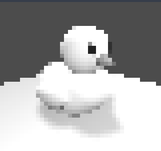

# Ascii_Shader

- [Ascii\_Shader](#ascii_shader)
  - [Info](#info)
  - [Intro](#intro)
  - [Technique](#technique)
    - [Create a full screen quad](#create-a-full-screen-quad)
    - [Make each screen's pixel 8x8](#make-each-screens-pixel-8x8)
    - [Compute pixel luminosity](#compute-pixel-luminosity)
    - [Quantize the luminosity values to the ascii character count](#quantize-the-luminosity-values-to-the-ascii-character-count)
    - [Map pixel to character](#map-pixel-to-character)
    - [Limit color values](#limit-color-values)
    - [B\&W shader](#bw-shader)
    - [Add color](#add-color)
  - [Future works](#future-works)
  - [Ending](#ending)
  - [Credits](#credits)

## Info

> - AUTHOR: Daniel Bologna (me)
> - GIT: https://github.com/AbstractBorderStudio
> - ITCH: https://abstractborderstudio.itch.io
> - GODOT_SHADER: https://godotshaders.com/author/dan/
> - ENGINE: Godot 4.3

## Intro
This shader is inspired by the ascii shader by Acerola [I Tried Turning Games Into Text](https://www.youtube.com/watch?v=gg40RWiaHRY)


It is not the same as Acerola's implementation. In fact, it lacks of the edge detection pass. I'll try to implement this later on this year.

## Technique

### Create a full screen quad

Follow the [Advanced post-processing](https://docs.godotengine.org/en/stable/tutorials/shaders/advanced_postprocessing.html) page from godot documentation.  

- Create a `MeshInstance3D`
- set it as a quad size 2x2 and flip the face
  - warining NOT the transform but the _quad size_.


- Add a `ShaderMaterial` in Geometry>MaterialOverride

in the vertex shader just add this line:

```
void vertex() 
{
	POSITION = vec4(VERTEX.xy, 1.0, 1.0);
}
```

After doing this your screen should be all white-ish.

> ⚠️ WARNING ⚠️ 
> 
> method changed from Godot 4.2 to 4.3 because of the introduction of the **reverse z buffer**. Read this article to find out more: [Introducing Reverse Z (AKA I'm sorry for breaking your shader)](https://godotengine.org/article/introducing-reverse-z/)

### Make each screen's pixel 8x8


Now, I'm using a 8x8 pixel ascii character like in the Acerola's video, so I need to make the screen pixel 8x8. This means taking the screen texture, enlarging it 8 times, flooring the value to delete all in-between values, and then donwscaling back to normal.

I did this transformation to the `SCREEN_UV`, than sample the screen texture on this downsampled uv.

```
vec2 down_sampled_uv = vec2(
                floor(uv.x * screen_size.x / pixel_size) / screen_size.x * pixel_size, 
                floor(uv.y * screen_size.y / pixel_size) / screen_size.y * pixel_size);
```

In Godot 4.3

- screen_size: `VIEWPORT_SIZE`
- pixel_size: `8.0` <- è la dimensione del carattere ascii


Now the screen should be made of 8x8 pixels, indipendenlty of the screen res.

### Compute pixel luminosity

Compute the pixel luminosity using the YUV formula ([About YUV Video](https://learn.microsoft.com/en-us/windows/win32/medfound/about-yuv-video)):

```
float _compute_luminosity(vec3 tex)
{
	return 0.2126 * tex.r + 0.7152 * tex.g + 0.0722 * tex.b; // [0, 1]
}
```

> As you can see the luminosity is a single channel value. In order to display it you should use something like:

```
ALBEDO = vec3(luminosity);
```



### Quantize the luminosity values to the ascii character count

Now we need to make the shades of gray of the luminosity fall in a range of fixed values eaquale to the number of character we want to use.

To do so we can multiply the range by the count of character, then flooring the result to delete all in-between values and then dividing by 8.

```
float _quantize(float value, float size)
{
	// value is a [0, 1] range
	// quantize the value as an integer between [0, 1] with a step of 1 / size
	return clamp(floor(value * size) / size, 0.0, 1.0);
}
```

In this way we have values between 0 and 1 with a step of 1/char_count. For instance, I use 10 ascii character so I'll have values like:

[0, 0.1, 0.2, 0.3, 0.4, 0.5, 0.6, 0.7, 0.8, 0.9]


We have 8 shades!

> ⚠️ WARNING ⚠️ 
>
> Because of my naive implementation I forgot to divide by the size, so my values go from 0 to 9
> 
> [0, 1, 2, 3, 4, 5, 6, 7, 8, 9]
>
> and the result looks burnt but **the information is still there**:
>
> 
>
> I will leave it like this. So the clamp in the previus formula goes from 0 to size-1
>
> `return clamp(floor(value * size), 0.0, size - 1.0);`

### Map pixel to character

Now. How the Duck (sorry I'm stupid) we make a pixel like an ascii character? The answer is to use a texture of the characters! So an 80x8 texture:


I borrowed the texture from [Acerola's public repo](https://github.com/GarrettGunnell/AcerolaFX/tree/main/Textures).

The idea is to map each pixel in the screen inside an 8x8 square and use the luminosity to check which character we want from the ascii texture.


The way I do this is:

1. get the pixel location using `FRAGCOORD`
2. get the relative position in a 8x8 pixel grid:
 
    To do this, use the modulo operator (%) for the x and y pixel coordinate dividing it by 8.

    ```
    vec2 _map_pixel_coord(vec2 fragcoord, float pixel_size)
    {
        // clamp pixel coordinate inside a (pixel_size x pixel_size) square
        return vec2(
                float(int(fragcoord.x) % int(pixel_size)), 
                float(int(fragcoord.y) % int(pixel_size)));
    }
    ```

    This code take the (x,y) position of the current pixel, and return a value between 0 and 7 for each axis. This allow us to move inside the correct asci character position.
3. use the pixel position and the luminance computed earlier to get the correct pixel value from the ascii texture.
   
    ```
    float _get_ascii(float index, vec2 coordinate, vec2 uv)
    {
        // get the single pixel scale relative to the [0, 1] uv range.
        float x_scale = 1.0 / (_char_count * _char_size);
        float y_scale = 1.0 / _char_size;
        
        // get the coordinate of the (x, y) pixel of the texture and scale the pixel fullscreen to get the color
        vec2 scaled_uv = uv / (vec2(_char_count, 1.0) * _char_size) 		// scale the uv so we have a single pixel from the texture
                + vec2(x_scale * _char_size * index, 0.0) 					// displace by moving 8 pixel at a time to reach the correct character
                + vec2(x_scale * coordinate.x, y_scale * coordinate.y); 	// get the (x,y) displaced position inside the character grid
        
        // return the ascii texture sampled in this new uv
        return texture(_ascii_tex, scaled_uv).r;
    }
    ```

    To more specific, I make so that a single pixel of the ascii texture fill the screen (so I get only that color), then translate the uv to get the corresponding (x,y) pixel value. 

### Limit color values

This way we have only black and white values, creating an effective mask.

```
// clamp the values
ascii = (ascii > 0.1) ? 1.0 : 0.0;
```

### B&W shader

Just output a vec3 with ascii for each value

```
ALBEDO = vec3(ascii);
```


### Add color

Just multiply the downsampled texture (which mantain color info) with the ascii value just computed that will work as a mask. And we're done!

```
...
vec3 tex = texture(_screen_texture, downsampled_uv);

...

ALBEDO = tex * ascii;
```


## Future works

- I'll try to implement a edge detection filter to add a ascii outline like in Acerola's video.
- Polish and optimization.

## Ending

Thank you for spending your time reading this article!

## Credits

- [I Tried Turning Games Into Text](https://www.youtube.com/watch?v=gg40RWiaHRY)
- [Advanced post-processing](https://docs.godotengine.org/en/stable/tutorials/shaders/advanced_postprocessing.html)
- [Introducing Reverse Z (AKA I'm sorry for breaking your shader)](https://godotengine.org/article/introducing-reverse-z/)
- [About YUV Video](https://learn.microsoft.com/en-us/windows/win32/medfound/about-yuv-video)
- [AcerolaFX repo](https://github.com/GarrettGunnell/AcerolaFX/tree/main)
